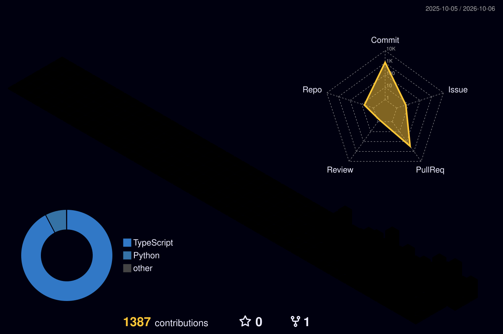

<!-- Header -->

  

  

  
  

---

## 👋 About me

- 🛠️ Full stack developer focused on **web & mobile products**: from database design to the pixels on screen
- 🇲🇳 Building software for real users in **Mongolia**: education, kindergartens, e-commerce and local businesses
- 📱 Shipping cross-platform mobile apps with **React Native + Expo** and APIs with **NestJS + PostgreSQL**
- 🌐 More about me at **[usukhbayar.dev](https://usukhbayar.dev)**

## 🧰 Tech stack

  

## 🏙️ My commit city

  

## 🚀 Featured projects

<table>
  <tr>
    <td width="50%" valign="top">
      <h3>⚡ <a href="https://github.com/usukh6ayar/SparkXP">SparkXP</a></h3>
      Gamified English learning app for Mongolian students, schools and organizations.
        
      
      
      
      
      
        
      🔗 <a href="https://spark-xp.vercel.app">Live</a>
    </td>
    <td width="50%" valign="top">
      <h3>🧸 <a href="https://github.com/usukh6ayar/NomadKids">NomadKids</a></h3>
      Digital child-development portfolio system for kindergartens, live in production.
        
      
      
      
      
      
        
      🔗 <a href="https://nomadkids.mn">nomadkids.mn</a>
    </td>
  </tr>
  <tr>
    <td width="50%" valign="top">
      <h3>🎓 <a href="https://github.com/usukh6ayar/Edu-SaaS">Edu-SaaS</a></h3>
      Multi-tenant SaaS platform for private education and training centers in Mongolia.
        
      
      
      
      
        
      🏗️ In planning &amp; architecture
    </td>
    <td width="50%" valign="top">
      <h3>👘 <a href="https://github.com/usukh6ayar/NomadThreads">NomadThreads</a></h3>
      Mobile e-commerce app for the traditional Mongolian deel.
        
      
      
      
    </td>
  </tr>
  <tr>
    <td width="50%" valign="top">
      <h3>💅 <a href="https://github.com/usukh6ayar/NailBliss-Digital-Loyalty-Card">NailBliss</a></h3>
      Digital loyalty card web app for a nail salon, so customers carry their card on their phone.
        
      
      
      
      
    </td>
    <td width="50%" valign="top">
      <h3>🌌 <a href="https://github.com/usukh6ayar/Portfolio">Portfolio</a></h3>
      Bilingual (EN / MN) personal portfolio: a dark, editorial product presentation.
        
      
      
        
      🔗 <a href="https://usukhbayar.dev">usukhbayar.dev</a>
    </td>
  </tr>
</table>

---

  

<!-- Footer -->

  

